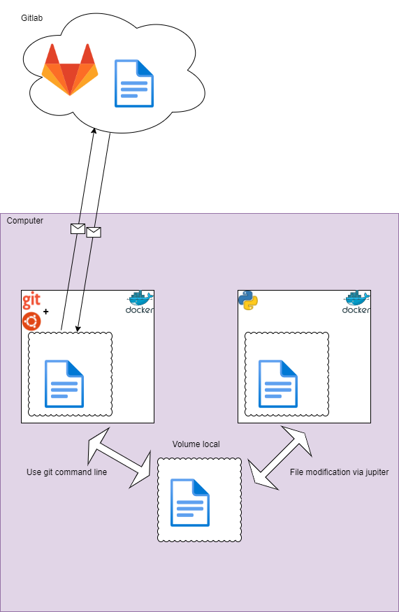

# Docker env  :whale2:

Create an environment for development. 

Git and Jupiter Lab share the same folder through a volume



## Creating an Independent Volume
```bat
docker volume create --name DataVolume
```

# Docker : Git :octocat:

## Build the git environement
```bat
docker build . -t dev
```
## Start the git environement
```bat
docker run -ti --rm -v DataVolume:/volume dev bash
```


# Docker : Jupiter Lab :snake:
```bat
docker run --user root -v DataVolume:/home/jovyan -e CHOWN_HOME=yes -e CHOWN_HOME_OPTS='-R' -it --rm -p 8888:8888 jupyter/datascience-notebook:latest
```


# Additional information :ghost:

## List all volumes in your computer
```bat
docker volume ls
```

## Remove a volume 
```bat
docker volume rm namevolume
```


